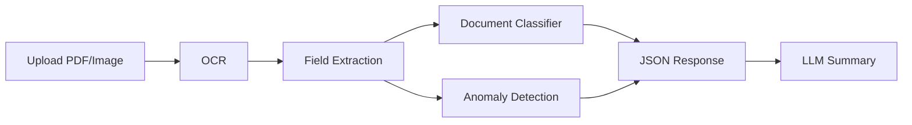

# AI-Powered Invoice & Expense Automation System

Automates invoice and expense processing by extracting financial data, classifying documents, detecting anomalies, and generating business summaries via REST APIs.

## Problem Statement

Companies receive large volumes of vendor invoices and employee expense receipts as PDFs/images. Manual processing is slow, error-prone, and doesn't scale. This system automates the end-to-end workflow: OCR → extraction → classification → anomaly detection → LLM summary.

## Architecture



| Stage | Component | Output |
|-------|-----------|--------|
| 1 | OCR (Tesseract) | Raw text |
| 2 | Field extraction (regex) | invoice_number, date, total, vendor, tax |
| 3 | Document classifier (ML) | invoice / receipt / other |
| 4 | Anomaly detection | duplicates, missing fields, total mismatch |
| 5 | LLM (Ollama) | Business summary |

## Quick Start

```bash
pip install -r requirements.txt
brew install tesseract poppler   # macOS

# Ollama must be running (open the app, or run `ollama serve` in another terminal)
ollama pull llama3.2

# Start API. Use --port 8001 if 8000 is already in use
uvicorn api.main:app --reload
```

Open http://localhost:8000 (or :8001)

## API Endpoints

| Method | Endpoint | Description |
|--------|----------|-------------|
| GET | `/health` | Health check |
| POST | `/api/upload` | Upload file, get path/size |
| POST | `/api/extract` | Extract fields only |
| POST | `/api/summary` | Generate LLM summary |
| POST | `/api/analyze` | Full pipeline (extract + classify + anomalies + summary) |
| POST | `/process-invoice` | Legacy; same as `/api/analyze` |

## Sample JSON Output

```json
{
  "document_type": "invoice",
  "classification_confidence": 0.7,
  "fields": {
    "vendor": "Acme Corp",
    "invoice_number": "INV-2025-001",
    "date": "2025-02-03",
    "currency": "USD",
    "subtotal": 1000.0,
    "tax": 100.0,
    "total": 1100.0,
    "line_items": [
      {"description": "Service A", "amount": 500.0},
      {"description": "Service B", "amount": 500.0}
    ]
  },
  "anomalies": [],
  "summary": "This invoice from Acme Corp for $1,100 on 2025-02-03 includes 10% tax. No discrepancies found."
}
```

## Usage Examples

**Extract fields:**
```bash
curl -X POST "http://localhost:8000/api/extract" -F "file=@invoice.pdf"
```

**Full analysis:**
```bash
curl -X POST "http://localhost:8000/api/analyze" -F "file=@invoice.pdf"
```

## Docker

```bash
docker-compose -f docker/docker-compose.yml up --build
```

Or build manually:
```bash
docker build -f docker/Dockerfile -t invoice-automation .
docker run -p 8000:8000 -e OPENAI_API_KEY=xxx invoice-automation
```

## Repo Structure

```
Invoice_Automation/
├── data/
│   ├── uploads/
│   └── sample_invoices/
├── api/
│   └── main.py           # FastAPI app
├── ocr/
│   ├── extract_text.py
│   └── extract_text_service.py
├── preprocessing/
│   └── field_extraction.py
├── models/
│   ├── doc_classifier.py
│   └── anomaly_detection.py
├── llm/
│   └── expense_summary.py
├── mlops/
│   └── mlflow_tracking.py
├── docker/
│   ├── Dockerfile
│   └── docker-compose.yml
├── tests/
└── requirements.txt
```

## Tech Stack

- **Python** · **FastAPI** · **Tesseract OCR** · **scikit-learn** · **Ollama** · **MLflow** · **Docker**

## Resume Bullet

**AI Invoice & Expense Automation System | Python, OCR, FastAPI, ML, MLflow, Docker**

- Built an AI system to automate invoice processing by extracting structured financial data from PDFs/images
- Developed ML-based document classification and anomaly detection (duplicates, missing fields, total mismatch)
- Integrated LLMs for business-ready summaries
- Exposed REST APIs (`/api/upload`, `/api/extract`, `/api/summary`, `/api/analyze`) and containerized with Docker
